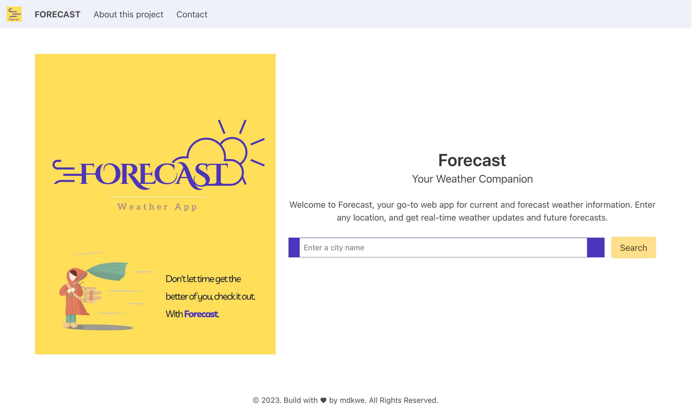
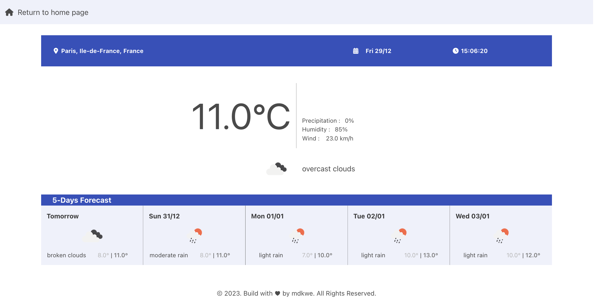

# Weather Forecast Application

## Project Overview
The Weather Forecast Application is a web-based tool providing current and future weather information. Leveraging APIs like [Geoapify](https://www.geoapify.com/) for geolocation services and [OpenWeatherMap](https://openweathermap.org/api) for weather data, this app features an intuitive interface with autocomplete functionality for searching city names.

## Interface Screenshots

Here are some screenshots showcasing the interface:

- 
- 

## Live Preview

Access a live preview of the application, hosted on Google Cloud: [Weather Forecast Application Preview](URL_TO_GOOGLE_CLOUD_PREVIEW)

## Input/Output Model of the Backend

### Input:
- **City Name**: User input for the desired city's weather information.

### Process:
- **Geocoding**: Utilizing the [Geoapify API](https://www.geoapify.com/) to convert city names into geographical coordinates.
- **Weather Data Retrieval**: Fetching weather data from [OpenWeatherMap API](https://openweathermap.org/api) using coordinates.

### Output:
- **Weather Information**: Displaying data such as temperature, humidity, and wind speed for the selected location.

## Installation and Setup

To set up the project locally:

1. **Clone the Repository**:
```bash
git clone https://github.com/mdkwe/Forecast.git
cd Forecast
```

2. **Create a Virtual Environment**:
- Unix/MacOS:
  ```
  python3 -m venv venv
  source venv/bin/activate
  ```
- Windows:
  ```
  python -m venv venv
  venv\\Scripts\\activate
  ```

3. **Install Dependencies**:
```bash
pip install -r requirements.txt
```

4. **Create `.env` files in the app folder for API Keys**:
```python
API_KEY_WEATHER = '[Your OpenWeather API Key]'
API_KEY_GEO = '[Your Geoapify API Key]'
API_KEY_MAIL = '[Your Web3forms API Key]'
```

4.Run the Application
```bash
python main.py
```

## TO DO List (Future Enhancements)

[ ] Implement User Authentication for personalized experiences as message for daily update about weather.
[ ] Implement additional error handling and validation for user inputs.
[ ] Develop a mobile-responsive design.
[ ] Optimize API usage to reduce load times
[ ] Improve UI/UX design for a more engaging user interface.
